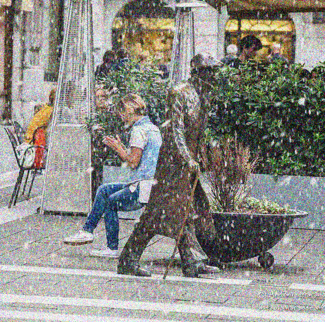

# Multi-Degradation Image Restoration with Extended DA-CLIP  

This repository contains the implementation of an **extension to DA-CLIP** for restoring images affected by **multiple simultaneous degradation types**. Our project explores the challenge of **multi-degradation image restoration**, specifically addressing a limitation highlighted in the **DA-CLIP paper**, where the original model supports only single-degradation scenarios.  

This work is built on the article **"Controlling Vision-Language Models for Multi-Task Image Restoration"**, available on **[arXiv](https://arxiv.org/abs/2310.01018)**. We extend the methods presented in this work to handle images with **multiple simultaneous degradations**. Full credit to the **original authors** of DA-CLIP, whose official GitHub repository can be found [here](https://github.com/Algolzw/daclip-uir/blob/main/da-clip/README.md).  

This project was conducted as part of the **Generative Models in AI** course, focusing on **enhancing generative techniques** for image restoration tasks.  

---

## 📌 Project Overview  

### 🔹 Motivation  
The DA-CLIP framework effectively restores **single-degradation images**, but real-world degraded images often contain **multiple noise sources**. Our approach extends DA-CLIP to handle **exactly two types of degradation per image**, generating additional **degradation embeddings** and modifying the **U-Net** model to process this additional information.  

### 🔹 Methodology  
1. **Input Processing**  
   - **LLQ (Lower-Quality) images** with two simultaneous degradations.  
   - Extraction of **Content Embedding** from DA-CLIP’s **Image Encoder**.  
   - Extraction of **two Degradation Embeddings** from DA-CLIP’s **Image Controller**.  

2. **Model Architecture**  
   - The **three embeddings** are **concatenated** and passed into a modified **U-Net**.  
   - The model is trained using **Mean Squared Error (MSE) loss**, the same loss function used in the original DA-CLIP paper.  

3. **Training Setup**  
   - Trained on **10,755 images** containing **24 different degradation combinations**.  
   - Used **the same datasets as DA-CLIP**, integrating additional degradations (noisy, blurry, JPEG-compressed).  
   - Trained for **7 epochs** due to computational constraints.  

### 🔹 Results  
- The model showed **some success** in reducing motion blur but **struggled with low-light noise**.  
- Performance was **inconsistent**, sometimes returning the **same degraded image** or generating **pure noise**.  
- Due to the **small dataset size and limited training time**, the model **did not generalize well** across all degradations.  

---

## 🔧 Installation & Setup  

### 📌 Prerequisites  
Ensure you have **Python 3.8+** installed along with the following dependencies:  

```bash
pip install torch torchvision transformers numpy matplotlib
```
### 📌 Clone the Repository and Navigate to `daclip-sde`  
To get started, clone this repository and navigate to the correct directory:  

```bash
git clone https://github.com/lielbin1/Multi-Degradation-DA-CLIP.git
cd Multi-Degradation-DA-CLIP/daclip-uir/universal-image-restoration/config/daclip-sde
```

### 📌 Run Training  
To train the model on the dataset, run the following command:  

```bash
python new_train.py
```
This script trains a U-Net model for multi-degradation restoration using DA-CLIP’s extracted embeddings. The model learns to reconstruct high-quality images from lower-quality images containing exactly two simultaneous degradations.

### 📌 Run Evaluation
To evaluate the model's performance on degraded images, use:

```bash
python evaluate.py --input <path_to_image>
```
Replace <path_to_image> with the path to the degraded image you want to restore.


## 📂 Dataset  

We used datasets from the original **DA-CLIP** paper, applying additional degradation integrations to adapt them for our research. Our dataset consists of **LLQ (Lower-Quality) images**, each containing **two simultaneous degradations** selected from predefined degradation types.

### 🔹 Degradation Types & Datasets  

| **Degradation Type**  | **Dataset**          | **Description**  |
|-----------------------|----------------------|------------------|
| **Motion Blurry**     | GoPro Dataset        | Contains motion-blurred frames paired with sharp ground truth images. |
| **Hazy**             | RESIDE-6K            | A benchmark dataset for dehazing tasks, containing hazy images with their clear counterparts. |
| **Low-Light**        | LOL Dataset          | Includes low-light images paired with their well-lit ground truth versions. |
| **Raindrop**         | RainDrop Dataset     | Comprises images with raindrop artifacts on the lens and their clean counterparts. |
| **Rainy**            | Rain100H             | A dataset with synthetic heavy rain and corresponding rain-free ground truth images. |
| **Shadowed**         | SRD Dataset          | Consists of shadowed images and their corresponding shadow-free versions. |
| **Snowy**            | Snow100K             | A large-scale dataset for snow removal tasks, featuring images with synthetic snow and their clean counterparts. |
| **In-Painting**      | CelebA-HQ-256        | A high-quality dataset used for image inpainting tasks, containing face images with occlusions. |

### 🔹 Custom Degradation Types  

In addition to the eight degradations from the original datasets, we introduced three additional degradation types using **custom code**:  

| **Degradation Type** | **Implementation** | **Parameter (`param`)** |
|----------------------|--------------------|-------------------------|
| **Gaussian Blur**   | Applies Gaussian blur with a kernel size | `param=25` sets kernel size to `(25, 25)`. |
| **Noisy**           | Adds Gaussian noise with adjustable intensity | `param=50` corresponds to a noise standard deviation of `50/255`. |
| **JPEG Compression**| Simulates JPEG compression artifacts | `param=10` applies heavy compression. |

### 🔹 Dataset Construction  

To create our **multi-degradation dataset**, we combined each of the **eight dataset-based degradations** with one of the **three generated degradations**, resulting in **24 unique degradation combinations** (`8 × 3`). The final dataset consists of **10,755 images**, each containing **exactly two degradations**.

An **illustrative example** is shown below, where the left image contains a **single degradation (snowy)** and the right image contains **two simultaneous degradations (snowy-noisy)**:  

<p align="center">
  
</p>

### 🔹 Download Dataset  
The dataset used in this project is available for download on **Google Drive**:  

📂 **[Multi-Degradation Dataset](https://drive.google.com/drive/folders/1yhOqNRh-nQh7c-ioEJdes_gcP064VMka?usp=sharing)**  

After downloading, ensure the dataset is placed in the appropriate directory before training.

---

## 🚀 Limitations & Future Work  

### 🔹 Current Limitations  
- The model **does not generalize** to images with **one or more than two degradation types**, as it was specifically trained for dual-noise scenarios.  
- Due to **computational constraints**, training was conducted on **only 10,755 images** for **7 epochs**, limiting the model's ability to generalize across diverse noise patterns.  
- Restoration quality varied across degradation types, with **motion blur showing improvement**, while **low-light noise remained challenging**.  

### 🔹 Future Work  
- **Flexible Multi-Degradation Handling**: Extend the model to **dynamically adjust** to images with a **variable number of degradations**, rather than being restricted to exactly two.  
- **Improved Embedding Integration**: Instead of simple concatenation, explore **cross-attention mechanisms** or **feature modulation layers** to better combine degradation embeddings with content embeddings.  
- **Extended Training**: Increasing the dataset size and the number of training epochs could improve performance, allowing the model to generalize more effectively across degradation types.  
- **Self-Supervised Learning**: Implement **self-supervised pretraining** to reduce dependency on large labeled datasets and enhance robustness to unseen degradations.  

---

## 👥 Contributors  

This project was conducted as part of the **Generative Models in AI** course at **Ben-Gurion University**.  

| **Name**             | **Email** |
|----------------------|-----------------------------|
| **Liel Binyamin**   | [lielbin@post.bgu.ac.il](mailto:lielbin@post.bgu.ac.il) |
| **Amit Brilant**    | [amitbri@post.bgu.ac.il](mailto:amitbri@post.bgu.ac.il) |
| **Nadav Cherry**    | [cherryn@post.bgu.ac.il](mailto:cherryn@post.bgu.ac.il) |
| **Alon Finestein**  | [alonfi@post.bgu.ac.il](mailto:alonfi@post.bgu.ac.il) |

For questions or collaboration, feel free to reach out to any of the contributors.


